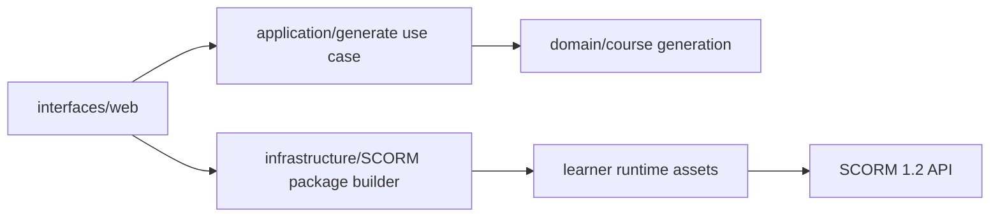

# Architecture

## System Purpose

This repository contains a browser-based SCORM app. A user provides a topic, visual theme, audience, objectives, timing, and quiz settings; the app generates an accessible microlearning preview and exports a SCORM 1.2 ZIP that can be uploaded to an LMS.

## Main Use Cases

- Generate a draft lesson from explicit user inputs.
- Preview generated slides and quiz questions directly in the app.
- Iterate on topic, visual theme, objectives, duration, slide count, question count, and passing score.
- Export a SCORM 1.2 package with `imsmanifest.xml`, learner runtime assets, content, scoring, and LMS progress reporting.
- Run unit, architecture, and package tests without external services.

## Quality Attributes

- Modifiability: generation policy, packaging mechanism, learner runtime, and browser UI are separated so new course strategies or export formats can be added without rewriting the app.
- Testability: domain generation does not depend on DOM, LMS APIs, ZIP bytes, filesystems, or network calls. The packaging adapter can be tested with fake runtime assets.
- Reliability: invalid generation requests raise explicit domain errors, package export logs failures, and the learner runtime falls back to local preview mode when no LMS API exists.
- Security: generated content is rendered with DOM APIs and `textContent`; package XML and HTML are escaped; telemetry redacts sensitive metadata keys.
- Observability: structured logs record generator startup, course generation, preview rendering, package export, learner launch, SCORM failures, and quiz submission.
- Deployability: the app is static files. Generated lessons are static SCORM 1.2 ZIPs with no backend dependency.
- Maintainability: tests enforce forbidden dependencies and manifest asset integrity.
- Performance: generation is deterministic and bounded by slide/question limits; ZIP creation uses stored files and small runtime assets.
- Accessibility: the UI uses labels, live status regions, semantic preview sections, keyboard-focus styling, and generated learner content avoids unsafe HTML injection.

## Module Diagram

## Dependency Rules

- Domain may depend only on standard JavaScript features and domain modules.
- Application may depend on domain.
- Infrastructure may depend on domain-shaped data and external file formats.
- Interfaces may depend on application and infrastructure.
- Learner runtime state (`course-state.js`) must not reference DOM, LMS, browser storage, network APIs, or packaging mechanisms.
- Business rules must not live in HTML, CSS, LMS adapters, or ZIP construction.

## Domain Model Summary

- GenerationRequest: topic, title, theme, audience, description, objectives, duration, slide count, question count, passing score, and tone.
- Course: generated course id, title, description, theme, passing score, slides, and questions.
- Slide: instructional content blocks or a quiz marker.
- ContentBlock: paragraph, list, tile group, or callout.
- Question: prompt, answer options, correct answer, and rationale.
- ThemeProfile: generated visual palette and motif derived from user theme text.

## Major Workflows

### Generate and Preview

1. The browser UI parses form input into an explicit request DTO.
2. The application use case calls the pure domain generator.
3. Domain validation rejects missing topics and clamps bounded numeric settings.
4. The UI renders summary metadata and preview slides using DOM APIs.

### Export SCORM

1. The UI fetches learner runtime assets from the static app.
2. The packaging adapter validates required runtime assets.
3. The packaging adapter creates personalized `index.html`, generated `course-content.js`, `imsmanifest.xml`, and a ZIP archive.
4. The browser downloads the ZIP for LMS upload.

### Learner Runtime

1. The generated package launches `index.html`.
2. `scorm.js` discovers the SCORM 1.2 API or enters preview mode.
3. `course.js` renders slides, persists progress, scores the quiz, and records pass/fail status.

## Key Tradeoffs

- Static browser app over backend service: simpler deployment and no server costs, but generation quality is deterministic template-based instead of model-backed.
- In-browser ZIP writer over npm dependency: no build step or supply-chain dependency, but only stored ZIP entries are supported.
- SCORM 1.2 over SCORM 2004 or xAPI: broad compatibility, but less rich tracking.
- Preview rendering inside the generator over launching an embedded SCO: faster iteration and simpler state isolation, but final LMS behavior still needs upload smoke testing.

## Extension Points

- Add new generation policies behind the application use case.
- Add an AI-backed provider adapter while keeping the deterministic generator as a fallback.
- Add SCORM 2004 or xAPI package builders beside the SCORM 1.2 adapter.
- Add persistence for saved drafts behind a repository port.
- Add visual themes by changing runtime CSS and package metadata.

## Known Limitations

- The first version uses deterministic templates, not an LLM or external content provider.
- Browser export requires serving over HTTP because runtime assets are fetched before packaging.
- Generated ZIP entries are stored, not compressed. Package sizes are still small for microlearning output.
- LMS compatibility should be smoke-tested in the target LMS because SCORM shells vary.
- Generated course artifacts are not committed to the repository; `course-content.js` exists only inside exported packages.

## Future Work

- Add draft save/load and version history.
- Add configurable interaction blocks beyond multiple-choice quizzes.
- Add automated browser accessibility checks.
- Add optional AI generation behind a provider port with retries, timeout handling, and cost controls.
